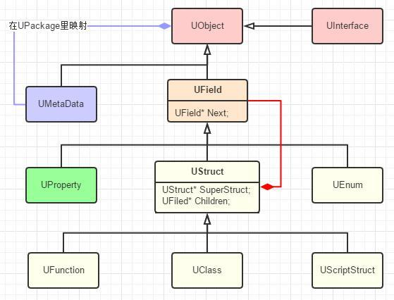

# 类型系统设定和结构

## 设定

这里重点有两点，

* 一、我们可以通过给类、枚举、属性、函数加上特定的宏来标记更多的元数据；
* 二、在有必要的时候这些标记宏甚至也可以安插进生成的代码来合成编译。

### 为何是生成代码而不是数据文件？

为了避免了不一致性，否则又得有机制去保证数据文件和代码能匹配上。

同时跨平台需求也很难保证结构间的偏移在各个平台编译器优化的不同导致得差异。所以还不如简单生成代码文件一起编译进去得了。

### 如果标记应该分析那个文件？

既然是C++了，那么生成的代码自然也差不多是.h.cpp的组合。

另一方面，用户对背后的代码生成应该是保持最小惊讶的，用户写下了A.h，他在使用的时候自然也会想include "A.h"，所以这个时候我们的A.generated.h就得找个方式一起安插进来，最方便的方式莫过于直接让A.h include A.generated.h了。

那既然每个需要分析的文件最后都会include这么一个*.generated.h，那自然就可以把它本身就当作一种标记了。所以UE目前的方案是每个要分析的文件加上该Include并且规定只能当作最后一个include，因为担心会有各种宏定义顺序产生的问题。

但是比如说想控制代码分析工具在分析某个特定文件的时候专门定制化一些逻辑，那这种像是C#里AssemblyAttribute的文件宏标记就显示出作用了。UHT目前不需要所以没做罢了。

## 结构

```C++
#include "Hello.generated.h"
UClass()
class Hello
{
public:
    UPROPERTY()
    int Count;
    UFUNCTION()
    void Say();
};
```



C++有声明和定义之分，图中黄色的的都可以看作是声明，而绿色的UProperty可以看作是字段的定义。在声明里，我们也可以把类型分为可聚合其他成员的类型和“原子”类型。

**聚合类型（UStruct）**：

* UFunction，只可包含属性作为函数的输入输出参数
* UScriptStruct，只可包含属性，可以理解为C++中的POD struct，在UE里，你可以看作是一种“轻量”UObject，拥有和UObject一样的反射支持，序列化，复制等。但是和普通UObject不同的是，其**不受GC控制**，你需要自己控制内存分配和释放。
* UClass，可包含属性和函数，是我们平常接触到最多的类型
**原子类型**：
* UEnum，支持普通的枚举和enum class。
* int，FString等基础类型没必要特别声明，因为可以简单的枚举出来，可以通过不同的UProperty子类来支持。

把聚合类型们统一起来，就形成了UStruct基类，可以把一些通用的添加属性等方法放在里面，同时可以实现继承。

UStruct这个名字确实比较容易引起歧义，因为实际上C++中USTRUCT宏生成了类型数据是用UScriptStruct来表示的。

还有个类型比较特殊，那就是接口，可以继承多个接口。跟C++中的虚类一样，不同的是UE中的接口只可以包含函数(可以有属性，但是不能添加Property相关的宏)。一般来说，我们自己定义的普通类要继承于UObject，特殊一点，如果是想把这个类当作一个接口，则需要继承于UInterface。但是记得，生成的类型数据依然用UClass存储。从“#define UINTERFACE(...) UCLASS()”就可以看出来，**Interface其实就是一个特殊点的类**。UClass里通过保存一个TArray\<FImplementedInterface> Interfaces数组，其子项又包含UClass* Class来支持查询当前类实现了那些接口。

最后是定义，在UE里是UProperty，可以理解为用一个类型定义一个字段“type instance;”。UE有Property，Property有众多子类，子类之多，一屏列不下。实际深入代码的话，会发现UProperty通过**模板实例化**出特别多的子类，简单的如UBoolProperty、UStrProperty，复杂的如UMapProperty、UDelegateProperty、UObjectProperty。

元数据UMetaData其实就是个TMap<FName, FString>的键值对，用于为编辑器提供分类、友好名字、提示等信息，最终发布的时候**不会包含此信息**。

蓝图里可以创建的枚举、接口、结构、类等。它们也都是相应的从各自UEnum、UScriptStruct、UClass再派生出来。

一旦我们能够用数据来表达类型了，我们就可以自定义出不同的数据来**动态**创建出不同的其他类型(反射)。

### 思考：为什么还需要基类UField？

* 为了统一所有的类型数据。可以用一个数组把所有类型数据都引用起来，方便遍历；顺序问题，要是想回溯出来一份定义，也可以跟原始的代码顺序一致，如果是用属性和函数分开保存的话，就会麻烦一些。
* 可以在基类(UField)里添加一份元数据(UMetaData)
* 方便添加一些额外的方法。

UField名字顾名思义，就是不管是声明还是定义，都可以看作是类型系统里的一个字段。

### 思考：为什么UField要继承于UObjce？

序列化是最重要的功能，GC和其他一些功能算是锦上添花。所以归结起来可有可无，再加上一些必要功能，本着统一的思想，就让所有类型数据也都继承于UObject了。这样序列化等操作也不需要写两套。虽然这看起来不是那么的纯粹，但是总体上来说利大于弊。

在对象上，你可以用Instance->GetClass()来获得UClass对象，在UClass本身上调用GetClass()返回的是自己本身，这样可以用来区分对象和类型数据。

## 总结

这套框架大体上可用，没什么问题，从UE3时代修修改改过来，已经很不容易了。

只是很多地方从技术角度上来说，不是那么的纯粹。比如：

* 接口的类型数据也是UClass，但是却又不允许包含属性。从结构上就没有做限制，只能通过UHT检查和代码中类型判断来区分；
* UStruct里包含的是UField链表，其实隐含的意思就是UStruct里既可以有嵌套类型又可以有属性，灵活的同时也少了限制，嵌套类型目前是没有了，但是UFunction也只能包含函数，UScriptStruct只有属性而不能有函数；
* UStruct里用UStruct* SuperStruct指向继承的基类。但是UFunction的基Function是什么意义？

UMetaData虽然在UPackage里用TMap\<UObject*，TMap\<FName, FString>>来映射，但是实际上也只有UField里有GetMetaData的接口，所以一般UMetaData也只是跟UField关联罢了。

UStruct包含UProperty、UClass和UScriptStruct又包含UFunction，这才是一般实操时用到的数据关联。

## 4.25以后的版本，UProperty已经被启用了；变成了FProperty，继承自FField(它不再继承自UObject，但是实现了序列化功能)
